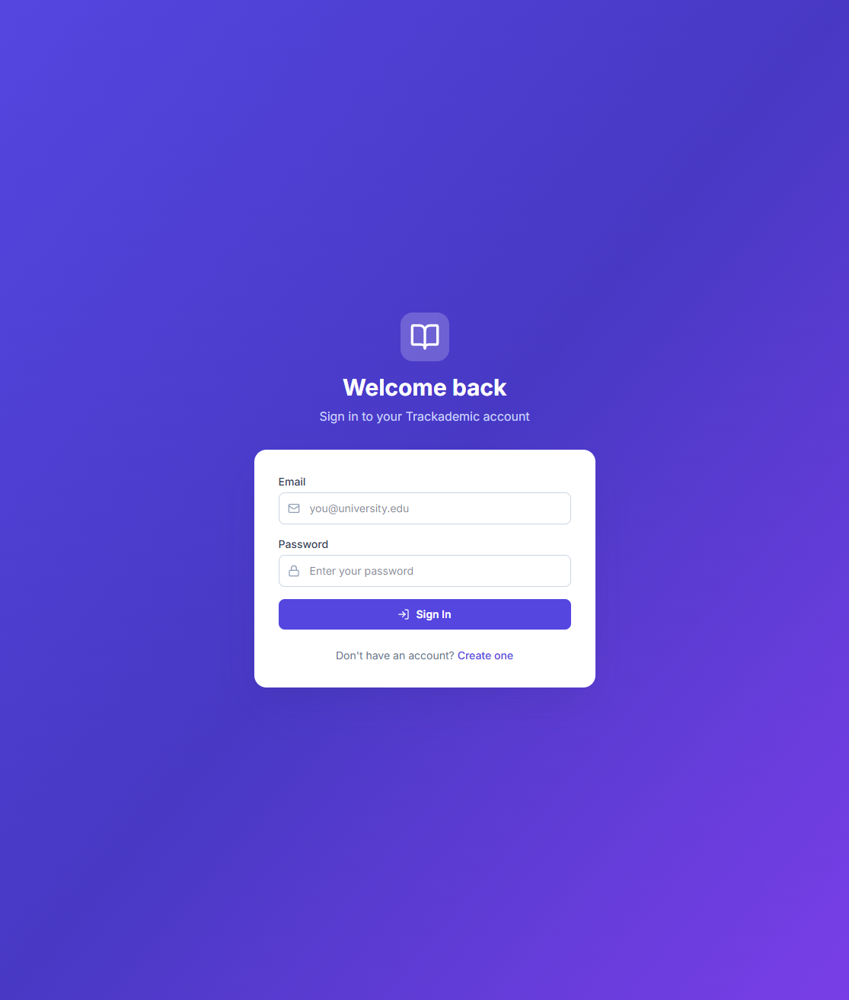
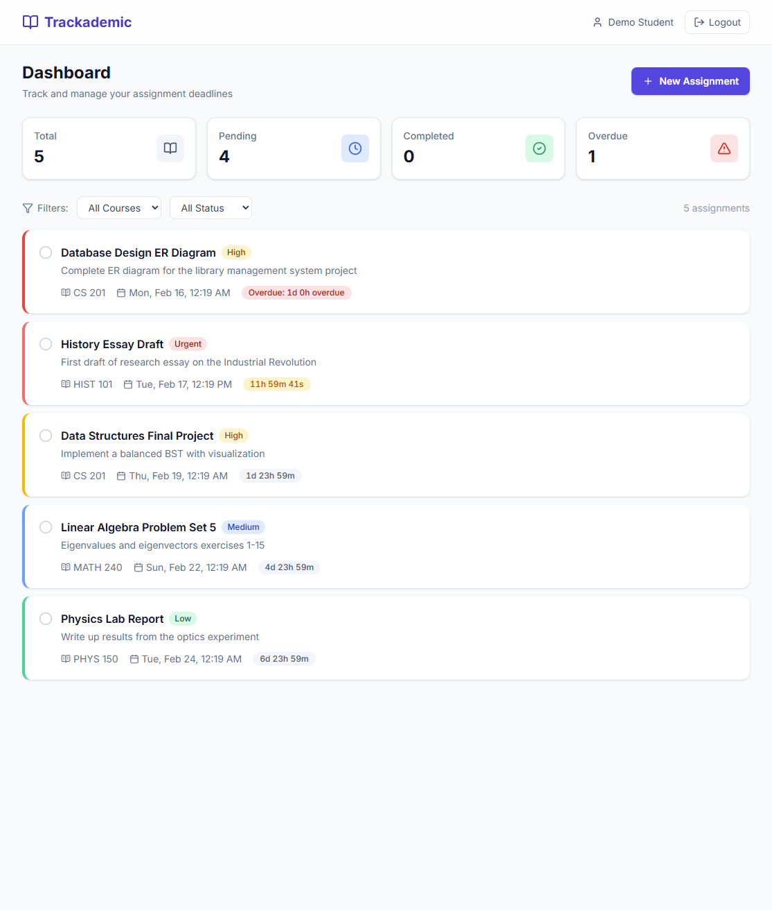

# Trackademic - Student Deadline Tracker

A full-stack web application that helps students track assignment deadlines, avoid missed submissions, and stay organized throughout the semester.

## Here's a representation of the website

### Login Page



### Dashboard



## Features

- **User Authentication** - Secure registration and login with JWT tokens
- **Assignment Management** - Full CRUD for assignments with title, description, course, deadline, and priority
- **Smart Dashboard** - Overview stats, filters by course/status, and real-time countdown timers
- **Email Reminders** - Automated reminders 24 hours and 1 hour before deadlines via SendGrid
- **Overdue Tracking** - Visual indicators for overdue and urgent assignments
- **Responsive Design** - Works seamlessly on desktop, tablet, and mobile

## Tech Stack

| Layer          | Technology                              |
| -------------- | --------------------------------------- |
| Frontend       | React, TypeScript, Vite, Tailwind CSS   |
| Backend        | Node.js, Express, TypeScript            |
| Database       | PostgreSQL, Prisma ORM                  |
| Authentication | JWT, bcrypt                             |
| Email          | SendGrid                                |
| Deployment     | Docker, Docker Compose, Render          |

## Project Structure

```
Trackademic/
├── client/                     # React frontend
│   ├── src/
│   │   ├── components/
│   │   │   ├── assignments/    # Assignment cards, form, filters, stats
│   │   │   ├── auth/           # Auth page layouts
│   │   │   ├── layout/         # Navbar, protected route
│   │   │   └── ui/             # Reusable UI components
│   │   ├── context/            # Auth context provider
│   │   ├── hooks/              # Custom hooks (countdown, assignments)
│   │   ├── pages/              # Page components
│   │   ├── services/           # API client with Axios
│   │   ├── types/              # TypeScript interfaces
│   │   └── utils/              # Helper functions
│   ├── Dockerfile
│   └── nginx.conf
├── server/                     # Express backend
│   ├── prisma/
│   │   ├── schema.prisma       # Database schema
│   │   └── seed.ts             # Seed data
│   ├── src/
│   │   ├── config/             # Environment, database
│   │   ├── controllers/        # Route handlers
│   │   ├── jobs/               # Cron jobs (reminders)
│   │   ├── middleware/         # Auth, validation, error handling
│   │   ├── routes/             # API route definitions
│   │   ├── services/           # Business logic
│   │   ├── utils/              # Error classes, validation schemas
│   │   └── server.ts           # App entry point
│   └── Dockerfile
├── docker-compose.yml
└── README.md
```

## Prerequisites

- **Node.js** v18+ and npm
- **PostgreSQL** v14+ (running locally or remotely)
- **SendGrid account** (optional, for email reminders)

## Getting Started

### 1. Clone the repository

```bash
git clone https://github.com/your-username/trackademic.git
cd trackademic
```

### 2. Set up the database

Make sure PostgreSQL is running locally. Create a database:

```sql
CREATE DATABASE trackademic;
```

### 3. Set up the backend

```bash
cd server
npm install
```

Copy the environment file and update it:

```bash
# Linux / macOS
cp .env.example .env

# Windows (cmd)
copy .env.example .env

# Windows (PowerShell)
Copy-Item .env.example .env
```

Edit `.env` with your database URL and a secure JWT secret.

Run Prisma migrations:

```bash
npx prisma migrate dev --name init
```

(Optional) Seed the database with sample data:

```bash
npm run prisma:seed
```

Start the development server:

```bash
npm run dev
```

The API will be running at `http://localhost:5000`.

### 4. Set up the frontend

Open a second terminal:

```bash
cd client
npm install
npm run dev
```

The app will be running at `http://localhost:5173`.

The Vite dev server proxies `/api` requests to the backend automatically.

## API Endpoints

### Authentication

| Method | Endpoint             | Description         |
| ------ | -------------------- | ------------------- |
| POST   | `/api/auth/register` | Register a new user |
| POST   | `/api/auth/login`    | Login               |
| GET    | `/api/auth/me`       | Get current user    |

### Assignments (requires authentication)

| Method | Endpoint                        | Description              |
| ------ | ------------------------------- | ------------------------ |
| GET    | `/api/assignments`              | List all assignments     |
| GET    | `/api/assignments/stats`        | Get dashboard stats      |
| GET    | `/api/assignments/courses`      | Get user's courses       |
| GET    | `/api/assignments/:id`          | Get single assignment    |
| POST   | `/api/assignments`              | Create assignment        |
| PUT    | `/api/assignments/:id`          | Update assignment        |
| DELETE | `/api/assignments/:id`          | Delete assignment        |
| PATCH  | `/api/assignments/:id/toggle`   | Toggle completion        |

### Query Parameters

- `course` - Filter by course name
- `status` - Filter by `completed`, `pending`, or `overdue`
- `priority` - Filter by `LOW`, `MEDIUM`, `HIGH`, or `URGENT`

## Docker Deployment

Build and run the entire stack with Docker Compose:

```bash
docker-compose up --build
```

This starts PostgreSQL, the backend API, and the frontend Nginx server. The app will be available at `http://localhost`.

## Deploying to Render

### Backend (Web Service)

1. Create a new **Web Service** on Render
2. Connect your GitHub repository
3. Set the root directory to `server`
4. Build command: `npm install && npx prisma generate && npm run build`
5. Start command: `npx prisma migrate deploy && node dist/server.js`
6. Add environment variables (DATABASE_URL, JWT_SECRET, etc.)

### Frontend (Static Site)

1. Create a new **Static Site** on Render
2. Connect your GitHub repository
3. Set the root directory to `client`
4. Build command: `npm install && npm run build`
5. Publish directory: `dist`
6. Add a rewrite rule: `/*` -> `/index.html` (for SPA routing)

### Database (PostgreSQL)

1. Create a new **PostgreSQL** instance on Render
2. Copy the internal connection string to your backend's `DATABASE_URL`

## Email Reminders

To enable email reminders:

1. Create a free [SendGrid](https://sendgrid.com) account
2. Create an API key with "Mail Send" permissions
3. Verify a sender identity
4. Add `SENDGRID_API_KEY` and `SENDGRID_FROM_EMAIL` to your `.env`

The cron job runs every 15 minutes and sends reminders:
- **24 hours** before deadline
- **1 hour** before deadline

In development without a SendGrid key, reminders are logged to the console.

## Demo Account

After seeding the database:

- **Email:** demo@trackademic.com
- **Password:** demo1234

## License

MIT
